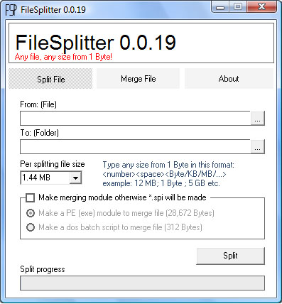



## sim756 FileSplitter

### Description

Use it to split & merge any file at any size (from 1Byte) that user have to type in "Per splitting file size" combo-box in this format: &lt;number&gt;&lt;space&gt;&lt;Byte/KB/MB/GB&gt; example: 12 MB; 1 Byte ; 5 GB etc. [Visual Basic 6.0]

License: GNU General Public License (GPL)

Author: http://sim756.googlepages.com/

Web: http://sourceforge.net/projects/filesplitter
 
### More Info
 

             |
---                |---
**Submitted On**   |2007-05-18 13:51:48
**By**             |[Sadequl Islam Mithun 756](https://github.com/Planet-Source-Code/PSCIndex/blob/master/ByAuthor/sadequl-islam-mithun-756.md)
**Level**          |Intermediate
**User Rating**    |5.0 (10 globes from 2 users)
**Compatibility**  |VB 6\.0
**Category**       |[Files/ File Controls/ Input/ Output](https://github.com/Planet-Source-Code/PSCIndex/blob/master/ByCategory/files-file-controls-input-output__1-3.md)
**World**          |[Visual Basic](https://github.com/Planet-Source-Code/PSCIndex/blob/master/ByWorld/visual-basic.md)
**Archive File**   |[sim756\_Fil2080928282007\.zip](https://github.com/Planet-Source-Code/sadequl-islam-mithun-756-sim756-filesplitter__1-69217/archive/master.zip)

